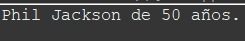
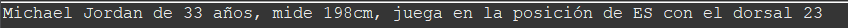
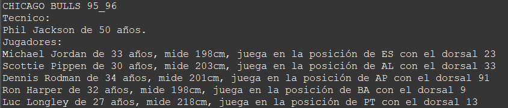
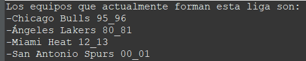
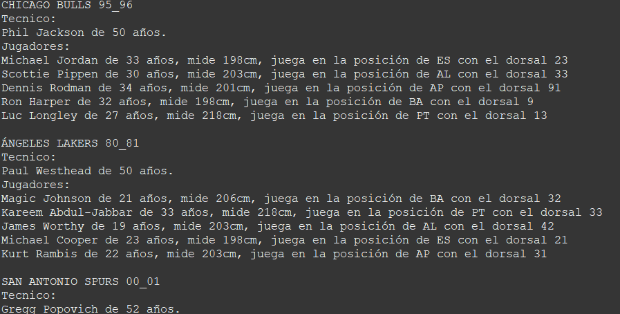
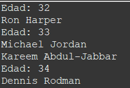

# Mejores equipos de la NBA

## ¿Qué es este repositorio?
Este repositorio ha sido creado como un ejercicio inventado por mí para prácticar programación funcional en Java. Tendremos que utilizar interfaces funcionales, expresiones lambda y Stream.
El ejercicio está hecho para forzar de cara a practicar. Todo lo importante van a ser métodos y propiedades estáticas con el único fin de que sea más rápido y ágil comprobar que la lógica del método este bien o no (que es lo que realmente nos interesa).

## Requisitos
En primer lugar, durante el ejercicio no se especifica nada sobre constructores, getter o setter. Escribe los que veas necesarios.

* Definir Enumerado **Posicion** dentro del paquete posiciones con los siguientes literales:
   
    * BA("Base")  AL(”Alero”)  ES(”Escolta”)  AP(”Ala-Pívot”)  PT(”Pívot”).

* Definir la clase **Tecnico** dentro del paquete persona con las siguientes propiedades:
   
   * nombre  apellido  edad
   * Define el método **toString()** para que muestre la información con el siguiente formato:
 
   

* Definir la clase **Jugador** dentro del paquete persona con las siguientes propiedades:
   
   * nombre apellido posicion edad dorsal alturaEnCm
   * Define el método **toString()** para que muestre la información con el siguiente formato:
 
   
   

* Definir la clase **Equipo** que tendrá las siguientes propiedades:
   
    * nombre  tecnico  listaDeJugadores
    * Define el método **toString()** para que muestre la información tal y como aparece a continuación:
  
    

  ```diff
  - ⚠️ IMPORTANTE     
  + El nombre del equipo se ha guardado en variable en minúscula, solo se muestra en mayúsuclas en el método toString()
  + Puedes probar a apoyarte en la clase Stringbuilder para poder sacar los jugadores. 

* Definir la clase **LigaNBA** dentro del paquete nba con la siguientes propiedad estáticas:
  
  * listaDeEquipos  (contendrá los siguientes equipos: lakers80_81  spurs00_01  miamiHeat12_13  chicagoBulls95_96)    
  * A continuación y para ahorrar tiempo dejaré una lista con los datos de cada equipo.
 
    <br>
    <b>Chicago Bulls 95_96</b>
  
    Tecnico: Phil Jackson Edad: 50
     
    Michael Jordan - Posición: Escolta (ES), Número: 23, Altura: 198 cm
      
    Scottie Pippen - Posición: Alero (AL), Número: 33, Altura: 203 cm
      
    Dennis Rodman - Posición: Ala-Pívot (AP), Número: 91, Altura: 201 cm
       
    Ron Harper - Posición: Base (BA), Número: 9, Altura: 198 cm
       
    Luc Longley - Posición: Pívot (PT), Número: 13, Altura: 218 cm

    <br>
    <b>Ángeles Lakers 80_81</b>
  
    Técnico: Paul Westhead Edad: 50
  
    Magic Johnson - Posición: Base (BA), Número: 32, Altura: 206 cm
  
    Kareem Abdul-Jabbar - Posición: Pívot (PT), Número: 33, Altura: 218 cm
  
    James Worthy - Posición: Alero (AL), Número: 42, Altura: 203 cm
  
    Michael Cooper - Posición: Escolta (ES), Número: 21, Altura: 198 cm
  
    Kurt Rambis - Posición: Ala-Pívot (AP), Número: 31, Altura: 203 cm

    <br>
    <b>San Antonio Spurs 00_01</b>
    
    Técnico: Gregg Popovich Edad: 52
    
    Tim Duncan - Posición: Ala-Pívot (AP), Número: 21, Altura: 211 cm
    
    David Robinson - Posición: Pívot (PT), Número: 50, Altura: 213 cm
  
    Manu Ginóbili - Posición: Alero (AL), Número: 20, Altura: 198 cm
  
    Tony Parker - Posición: Base (BA), Número: 9, Altura: 188 cm
  
    Bruce Bowen - Posición: Escolta (ES), Número: 12, Altura: 201 cm

     <br>
    <b>Miami Heat 12_13</b>
    
    Técnico: Erik Spoelstra Edad: 42
  
    LeBron James - Posición: Alero (AL), Número: 6, Altura: 203 cm
      
    Dwyane Wade - Posición: Escolta (ES), Número: 3, Altura: 193 cm
      
    Chris Bosh - Posición: Ala-Pívot (AP), Número: 1, Altura: 211 cm
      
    Ray Allen - Posición: Escolta (ES), Número: 34, Altura: 196 cm
      
    Mario Chalmers - Posición: Base (BA), Número: 15, Altura: 188 cm


* Definir una clase **Main** dentro del paquete main para realizar todas las pruebas necesarias.

* Definir las siguientes excepciones dentro del paquete excepciones:
   
    * Crear la excepción **EquipoNoEncontradoException**
    * Crear la excepción **TecnicoNoEncontradoException**


* Definir los siguientes métodos en la clase **LigaNba**
   
  Todos los métodos son estáticos para poder interactuar con las propiedades estáticas. Todo ello orientado a que probarlos sea más fácil ya que no tendremos que ir creando instancias si no usar las propiedades de las que disponemos.
  
  * **informacionBasicaDeLaLiga()**
  
    Muestra la información con el siguiente formato:
  
    
  
  * **informacionDetalladaDeCadaEquipo()**
  
    Muestra la información con el siguiente formato:
    
    
  
  * **obtenerUnEquipoPorSuNombre()**
  
    Debemos introducir el nombre del equipo y obtener dicho equipo, si el nombre es incorrecto y no se encuentra ningún equipo lanzamos la excepción **EquipoNoEncontradoException**
  
  * **obtenerUnEquipoPorSuTecnico**
  
    En este método queremos introducir el nombre y apellido del técnico para obtener el equipo al que entrena. En caso de que hubiera un entrenador que entrenara dos equipos, queremos que devuelva el primero que encuentre.
    En esta ocasión el método devolverá un Optional del resultado. Si no encontrara ningún equipo, deberá lanazrse la excepción *TecnicoNoEncontradoException**.
    
  * **obtenerTodosLosJugadores()**
  
    Queremos obtener una lista con todos los jugadores.
    
  * **obtenerEdadMediaJugadoresDeLaLiga()**
  
    Queremos obtener un double con la edad media de todos los jugadores. En caso de no existir ningún jugador en la liga, el método debe devolver 0.
    
  * **obtenerEdadMediaJugadoresDeUnEquipo**
  
    Queremos obtener un double con la edad emdia de todos los jugadores de un equipo, para ello introduciremos el nombre del equipo como hemos hecho anteriormente. En caso de no existir ningún jugador o de que el nombre del equipo este mal escrito, devolverá 0.
    
  * **obtenerJugadoresDeLaLigaPorPosicion**
  
    Queremos introducir una posición y obtener una lista de todos los jugadores de la liga que tienen asociada esa posición. En caso de no haber jugadores, retornaremos una lista vacía.
    
  * **obtenerPersonasActivasEnLaLiga()**
  
    Queremos obtener un int con el número total de **personas** que participan en la liga.
    
  * **jugadorDeMenorAltura()**
  
    Queremos obtener el jugador con menor altura de la liga.
    
  * **jugadorDeMayorAltura()**
  
    Queremos obtener el jugador con mayor altura de la liga.
    
  * **imprimirJugadoresOrdenadosPorNombreConElApellidoEnPrimerLugarYEnMayusculas()**
  
    El nombre del método deja claro lo que se busca.
    
  * **imprimirJugadoresPorDorsalOrdenadosPorAlturaDescendente()**
  
    El nombre del método deja claro lo que se busca.
    
  * **imprime5JugadoresAleatoriosDeLaLigaOrdenadosPorNombre()**
  
    Imprimir 5 jugadores aleatorios de la liga, cada vez que el método se ejecute debe sacar los jugadores de forma aleatoria.
    
  * **imprimeLasDiferentesAlturasDeJugadoresDeLaLigaPorOrdenAscendente()**
  
    Imprime por pantalla las diferentes alturas de los jugadores, si una altura se repite solo tiene que aparecer una vez, el orden debe ser ascendente.
    
  * **imprimeUnMapaDeLaEdadYLosJugadoresDeEsaEdadOrdenadoPorEdad()**
  
    Imprime un mapa con la edad de los jugadores y los jugadores que tienen esa edad ordenados por edad con el siguiente formato:
    
    
    
  * **imprimeUnMapaDeLasPosicionesYLosJugadores()**
  
    Imprime un mapa con el nombre de las posiciones en mayúscula y los jugadores que juegan en esa posición con el siguiente formato:
    
    
    


        
